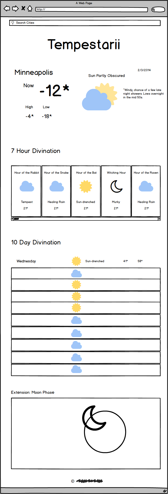

# Weatherly Project

###Live Project
See this project live [here](http://melenasuliteanu-tempestarii.surge.sh/)

### Tempestarii

This project is a weather application for witches. Tempestarii is the name for weather witches in midieval lore. A witch/warlock can come to this site and find a description of the current weather, a 7 hour divination (forecast), and a ten day divination.
Data comes from the weather underground api.

### Wireframes



### Finished Design


### Installation

To install the dependencies:

```
npm install
```

To fire up a development server:

```
npm start
```

Once the server is running, you can visit:

* `http://localhost:8080/webpack-dev-server/` to run your application.
* `http://localhost:8080/webpack-dev-server/test.html` to run your test suite in the browser.

To build the static files:

```js
npm run build
```


To run tests in Node:

```js
npm test
```
